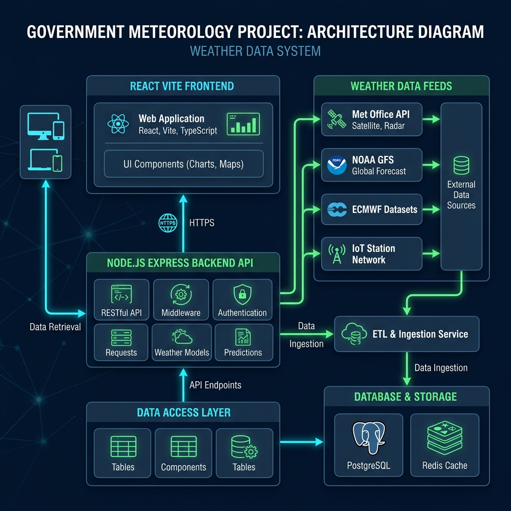
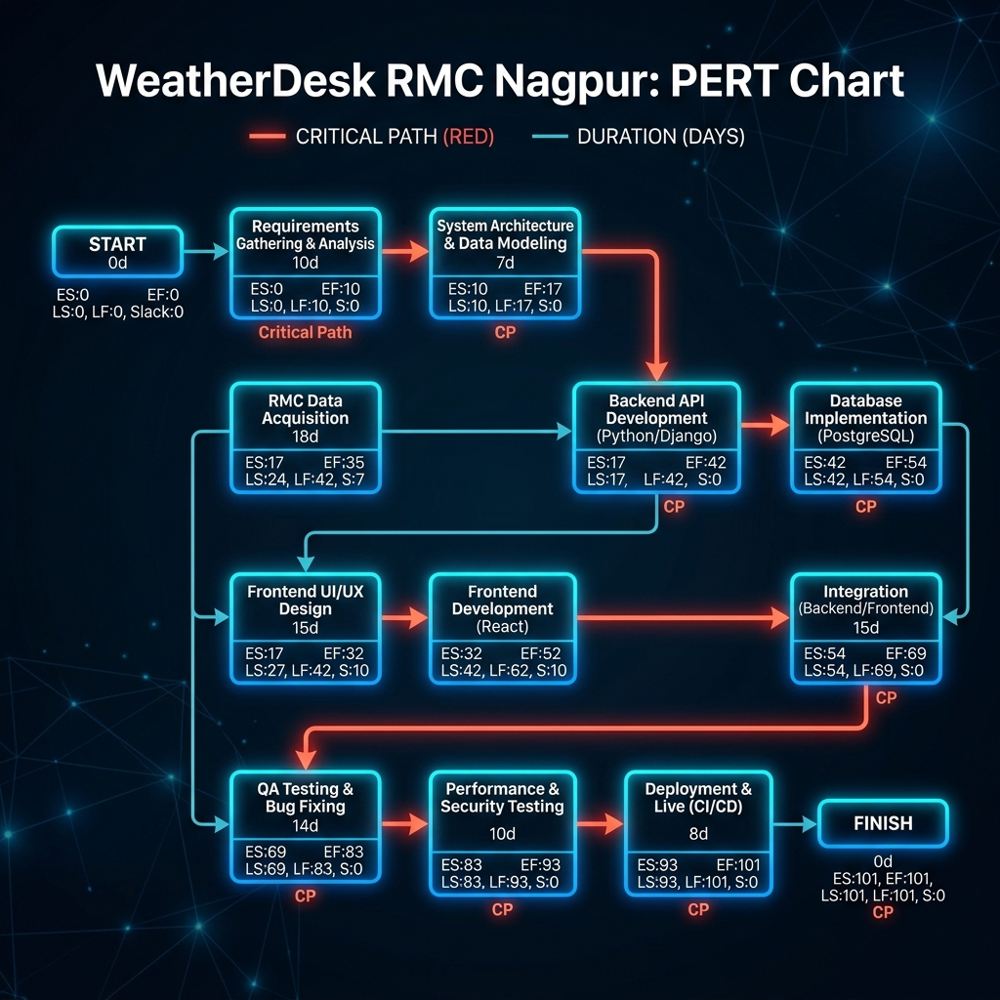

# WeatherDesk — RMC Nagpur 🌩️

**Automated Weather Forecast Management & Analytics Platform**
Developed as a production-ready MVP for the Regional Meteorological Centre (RMC), Nagpur — India Meteorological Department (IMD).

---

## 🎯 Project Overview
WeatherDesk is a modern, full-stack weather intelligence and report automation platform designed for government meteorological offices. It streamlines the tracking of real-time weather observations, automates the generation of official weather bulletins, and offers AI-assisted data retrieval via an integrated chatbot.

### ✨ Core Features
- **Live Weather Dashboard**: Interactive hover-based analytics cards for 12 Vidarbha districts.
- **Report Automation**: Auto-generates official daily and weekly weather bulletins.
- **Export Capabilities**: Export reports to **PDF**, **DOCX**, **CSV**, **JSON**, and **PNG** formats.
- **RMC Weather Assistant**: AI Chatbot providing real-time data lookups and alerting insights.
- **Visual Analytics**: Interactive Recharts-based data visualization and trend analysis.
- **Government-Grade UI**: Exact replication of the official IMD headers and dark-mode premium aesthetics.

---

## 🏗️ System Architecture
The application is built using a modern full-stack JavaScript architecture.

- **Frontend**: React 18, Vite, TailwindCSS, Framer Motion, Recharts
- **Backend**: Node.js, Express.js
- **Data Layer**: Mock Live API serving realistic JSON meteorological data for Vidarbha.



### PERT Chart


*(Note: Diagrams were generated as part of the project documentation requirements).*

---

## 🚀 Quick Start (Local Development)

### Prerequisites
- [Node.js](https://nodejs.org/en/) (v18+)
- npm or yarn

### 1. Clone & Install
```bash
git clone <repository-url>
cd weatherdesk-rmc-nagpur

# Install all dependencies (Frontend & Backend)
npm run install:all
```

### 2. Run the Backend API
```bash
cd backend
npm start
# Backend runs on http://localhost:3001
```

### 3. Run the Frontend (in a new terminal)
```bash
cd frontend
npm run dev
# Frontend runs on http://localhost:5173
```

---

## 🌍 Production Deployment & Hosting
This project is configured to be easily deployed to **Heroku**, **Render**, **Railway**, or any standard Node.js hosting provider. The Express backend is configured to statically serve the built Vite frontend.

### Deployment Steps:
1. Build the frontend:
   ```bash
   npm run build
   ```
2. Start the production server:
   ```bash
   npm start
   ```
   *The server will start the API and serve the React application on the same port.*

---

## 📝 Internship Details
- **Project**: WeatherDesk
- **Organization**: Regional Meteorological Centre, Nagpur | India Meteorological Department (IMD)
- **Ministry**: Ministry of Earth Sciences, Government of India
- **Period**: 25 May 2026 – 30 June 2026

*Note: This is a prototype system developed for demonstration and internal review. It is not currently for operational use.*
