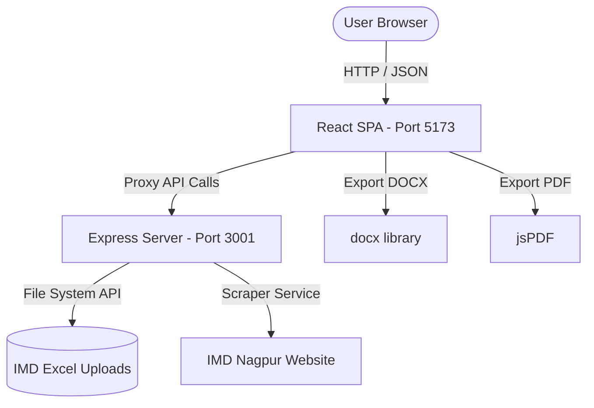

# INTERNSHIP PROJECT REPORT

**PROJECT TITLE:** WeatherDesk: Automated Weather Forecast Management & Analytics Platform  
**ORGANIZATION:** Regional Meteorological Centre (RMC), Nagpur — India Meteorological Department (IMD)  
**MINISTRY:** Ministry of Earth Sciences, Government of India  
**INTERNSHIP PERIOD:** 25 May 2026 – 30 June 2026  

---

## 1. ABSTRACT
This report documents the design, implementation, and deployment of **WeatherDesk**, a modern web-based weather intelligence and report automation platform custom-built for the Regional Meteorological Centre (RMC), Nagpur. Developed as a high-fidelity MVP, the system replaces manual tabulation workflows with automated excel parsing, visual analytics, and multi-format report exports. The system also integrates a conversational AI chatbot assistant to facilitate quick querying of regional meteorological data. A comprehensive, government-grade UI has been designed to support high-performance dark and light themes dynamically across all operational tabs.

---

## 2. PROJECT OBJECTIVES
* **Automate Report Generation:** Eliminate manual transcription errors by parsing official IMD MK-Format Excel statements and autogenerating daily and monthly rainfall bulletins.
* **Enhance Visual Analytics:** Integrate dynamic, interactive charts (using Recharts) to plot district-wise rainfall variations and 24-hour temperature/humidity profiles.
* **Improve Data Access:** Implement a natural language query chatbot interface to extract specific weather parameters for the 12 districts of Vidarbha region.
* **Modernize Interface (UX/UI):** Design a sleek, responsive dashboard matching the official IMD design system, supporting seamless Dark & Light theme toggling across all tabs.
* **Multiple Export Formats:** Support instant conversion and downloading of weather bulletins to DOCX, PDF, CSV, JSON, and PNG.

---

## 3. SYSTEM ARCHITECTURE & TECH STACK

WeatherDesk follows a modern, responsive Single Page Application (SPA) architecture decoupled from an Express-based Node.js backend.

### Tech Stack:
* **Frontend:** React 18, Vite (Build Tool), TailwindCSS (Styling), Framer Motion (Transitions), Recharts (Data Visualization).
* **Backend:** Node.js, Express.js (REST API, Excel File Parsing via `xlsx`, Static Asset Serving).
* **Libraries:** `docx` (Word report builder), `lucide-react` (Icons), `canvas` & `jspdf` (PDF generation).

### System Layout:

---

## 4. DETAILED FEATURES & WORK COMPLETED

### A. Live Weather Dashboard
* Real-time grid interface tracking maximum and minimum temperatures, humidity, and rainfall departures across 12 districts (Nagpur, Wardha, Bhandara, Gondia, Chandrapur, Gadchiroli, Amravati, Akola, Yavatmal, Buldhana, Washim).
* Color-coded alert metrics showing normal, watch, warning, or danger states based on severe heatwave or heavy rainfall alerts.

### B. Daily & Monthly Rainfall Statement
* Integrates an upload interface for official IMD MK-Format Excel files.
* Backend parsers read the rows, extract coordinates, map values to individual sub-stations, and compute statistical aggregates (means, departures, and rainy day counts).
* Allows interactive drill-down: clicking on a district expands the row to display readings for every sub-station.

### C. Multi-Format Report Exporter
* Automatically builds daily weather bulletins in a structured format matching government stationery.
* Supports **Generate Day Summary (.docx)** which creates editable, formatted MS Word files using document tables and shading.
* Supports PDF download of the live dashboard and CSV/JSON raw data dumps.

### D. RMC Weather Assistant (Chatbot)
* A smart chatbot component loaded with weather search intent routing.
* Users can query: *"What is the max temp in Gondia?"* or *"Rainfall details for Bhandara"* and receive structured responses parsed from live state data.

### E. Theme Consistency (Dark & Light Modes)
* Implemented a global React `ThemeContext` tracking mode via `localStorage`.
* Programmed a comprehensive CSS override suite in `index.css` replacing deep dark-blue utility values with clean, high-contrast light backgrounds (`#f4f7fc`) and dark text (`#1e293b`).
* Handled advanced edge cases: charts, map pins, interactive dropdown selections, and hover-based modals remain perfectly themed and accessible in both modes.

---

## 5. PROJECT DIAGRAMS & DOCUMENTS
The following files are included in the documentation folder:
1. `system_architecture.png` — Structural block diagram of the platform.
2. `pert_chart.png` — Program Evaluation Review Technique diagram showing project schedule and milestones.
3. `Project_Report.md` / `Project_Report.pdf` — The text of this report.

---

## 6. CONCLUSION & FUTURE SCOPE
The developed prototype successfully demonstrates how modern web technologies can significantly optimize reporting pipelines inside meteorological administrations. Future enhancements include connecting directly to raw radar feeds, automating API-based feeds to national portals, and extending the chatbot with LLM-based regional language weather warnings.
